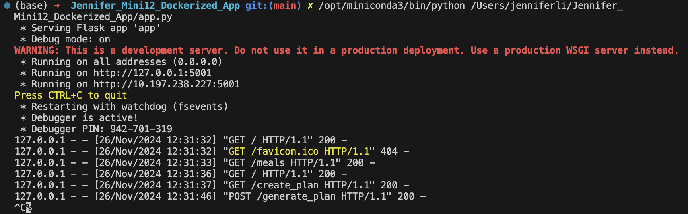
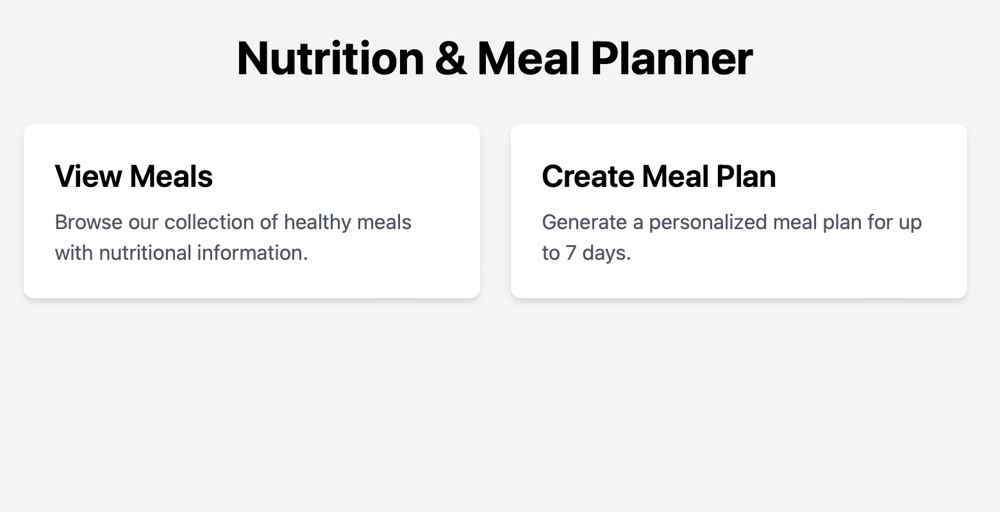
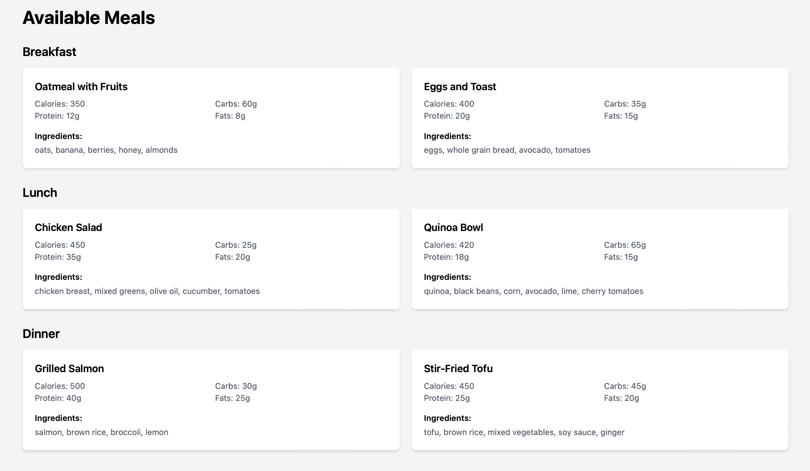
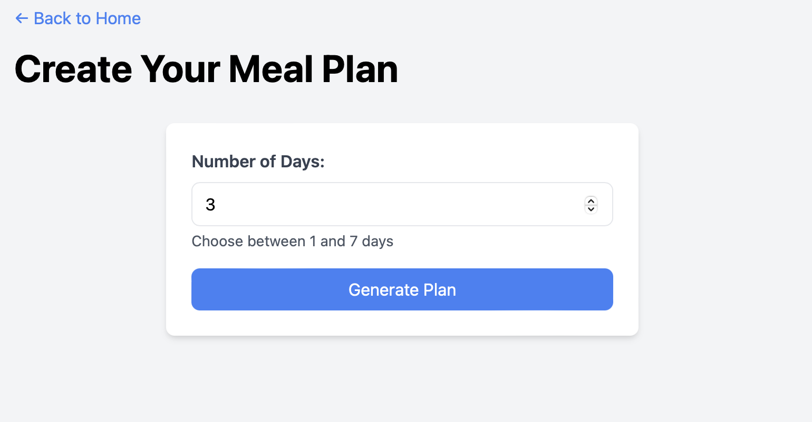
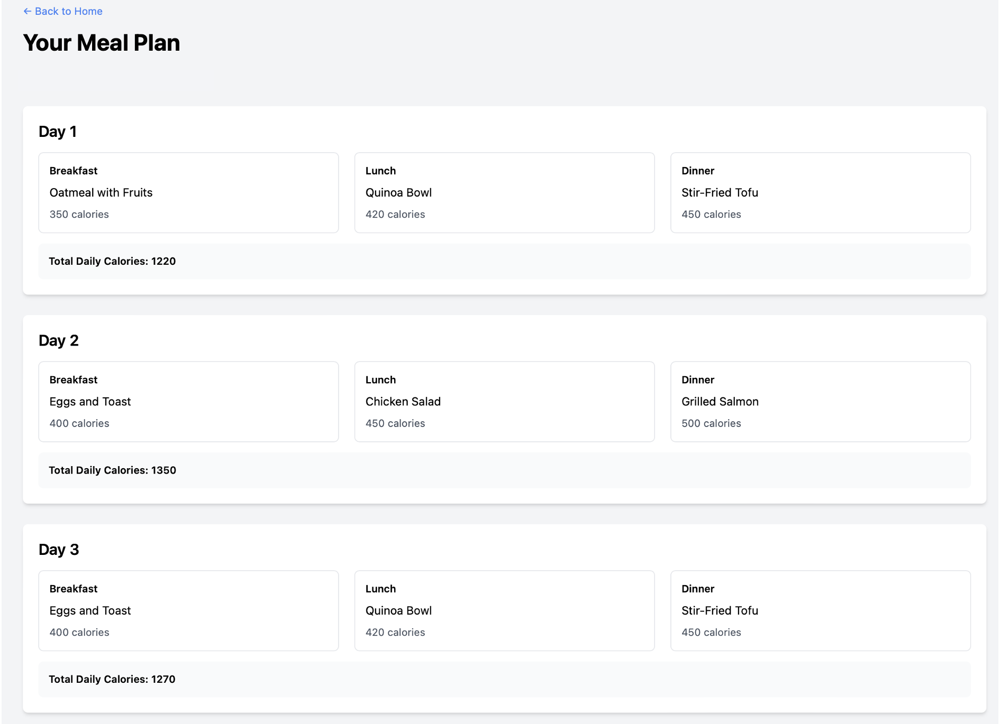
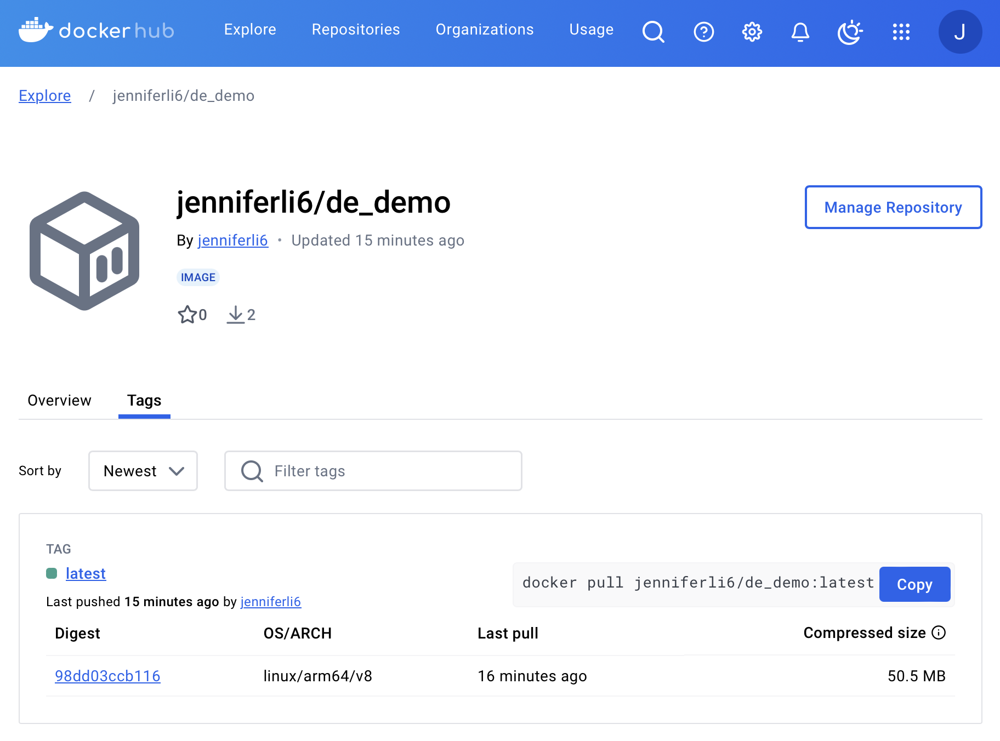
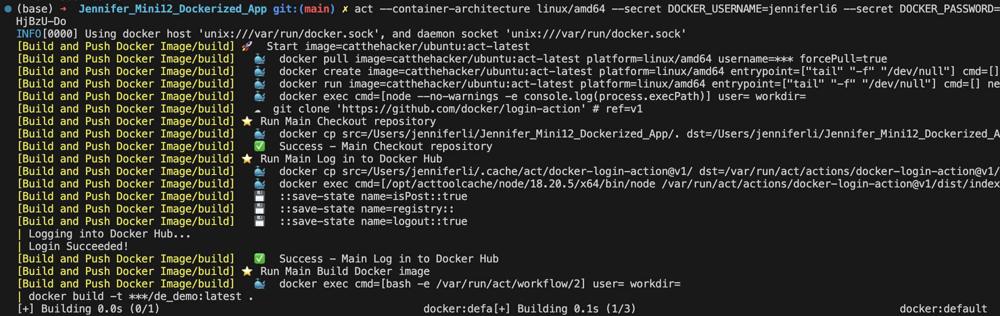
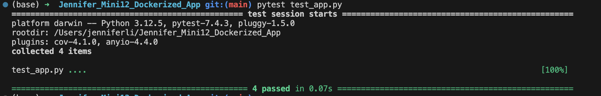

[](https://github.com/nogibjj/Jennifer_Mini12_Dockerized_App/actions/workflows/CI.yml)

# Mini12 Dockerized Meal Planner Application

In this project develops, I developed a containerized Flask application that generates personalized meal plans based on a database of pre-defined healthy meals. The application helps users create balanced meal plans with automatic calorie tracking and meal variety.

## Features

- Browse available meals with detailed nutritional information
- Generate meal plans for 1-7 days
- Automatic calorie calculation for daily meals
- Intelligent meal selection to avoid repetition
- Detailed nutritional information including protein, carbs, and fats
- Complete ingredient lists for each meal

## Project Structure

```
.
├── .devcontainer/
├── .github/
│   └── workflows/
│       └── CI.yml
├── templates/
│   ├── create_plan.html
│   ├── index.html
│   ├── meals.html
│   └── plan_result.html
├── app.py
├── Dockerfile
├── Makefile
├── README.md
├── requirements.txt
└── test_app.py
```

## Local Development

1. Clone the repository:
```bash
git clone <repository-url>
cd <repository-name>
```

2. Create and activate a virtual environment (optional):
```bash
python -m venv venv
source venv/bin/activate  # On Windows: .\venv\Scripts\activate
```

3. Install dependencies:
```bash
pip install -r requirements.txt
```

4. Run the application:
```bash
python app.py
```



5. Access & use the App

5.1 Click the link `http://localhost:5001` to visit the application



5.2 Click **Available Meals** to browse the available meals for breakfast, lunch and dinner, with detailed nutritional information.



5.3 Enter the **Number of Days** for which you want to generate meal plans, then click **Generate Plan**.



5.4 View the generated meal plan and **Total Daily Calories**.




## Dockerhub Image

The application image is available on Docker Hub: 
[Docker Hub repository](https://hub.docker.com/r/jenniferli6/de_demo/tags)






## Testing

Run the tests using:
```bash
python -m pytest test_app.py
```


## Continuous Integration

The project uses GitHub Actions for CI/CD. The workflow includes:
- Running tests
- Building Docker image
- Publishing to Docker Hub

